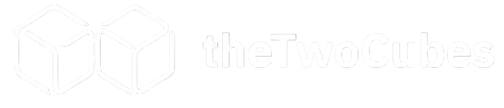

 

We build SaaS products, automations, and startup MVPs.

theTwoCubes is a product-focused engineering team that works with founders and businesses to turn ideas into scalable, production-ready software. We focus on speed, clarity, and execution.

## What We Do

### SaaS Development
End-to-end development of scalable SaaS platforms. From architecture to deployment, we handle the full lifecycle.

### Automation Systems
We design and implement automation workflows that reduce manual effort, improve efficiency, and integrate seamlessly with existing systems.

### Startup MVPs
We help founders launch quickly with lean, high-quality MVPs designed for validation and iteration.

## Our Approach

- Clear scope and documentation before development  
- Fast iteration cycles with continuous feedback  
- Production-grade code from day one  
- Focus on real business outcomes, not just features  

## Working With Us

We typically work with early-stage startups, founders, and small teams looking to build or scale products quickly.

If you have an idea or need help building, feel free to reach out.

|        |                          |
|--------|--------------------------|
| Website | https://thetwocubes.com |
| Email   | build@thetwocubes.com   |

## Repositories

This organization contains internal tools, client projects, and open source work maintained by theTwoCubes team.